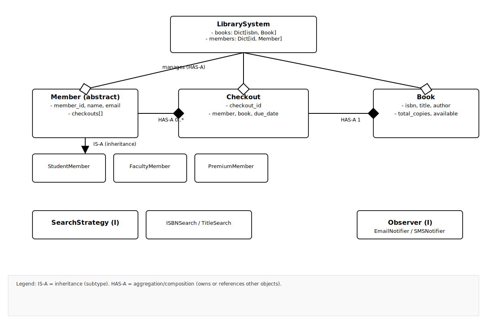

# Library Management System - 75 Minute Interview Guide

## Timeline Overview

```
┌─ 0-5 min   ┐ Problem Clarification
├─ 5-15 min  ┤ System Design & Architecture
├─ 15-60 min ┤ Implementation (5 phases)
└─ 60-75 min ┘ Testing & Discussion
```

---

## Phase 0: Problem Clarification (5 minutes)

### Questions to Ask
1. **Scope**: How many books and members? (assume 10K books, 1K members)
2. **Member types**: Student, Faculty, Premium? (assume yes)
3. **Checkout limits**: Different per member type? (assume yes)
4. **Due dates**: Fixed or member-specific? (assume fixed: 14/21/30 days)
5. **Fine system**: Fixed rate or member-based? (assume $0.50/day, $0.25/day premium)
6. **Search**: By ISBN, title, author? (assume all three)
7. **Features**: Priority - reservations, fines, notifications? (assume fines first)

### Good Answer
"I'll design a library system with:
- 10K books, 1K members (3 member types)
- Checkout limits: Student 5 books, Faculty 10, Premium 15
- Due dates: Student 14 days, Faculty 21, Premium 30
- Fine system: $0.50/day standard, $0.25/day premium
- Search: ISBN, title, author
- Singleton pattern for library
- Strategy pattern for search and fines
- Observer pattern for notifications"

---

## Phase 1: System Design (10 minutes, 0 lines of code)

### Architecture Sketch (Draw on whiteboard)

```
                    LIBRARY SYSTEM
                     (Singleton)
                          │
        ┌─────────────────┼──────────────────┐
        │                 │                  │
    ┌───▼────┐        ┌──▼────┐        ┌───▼────┐
    │ MEMBER │        │ BOOK  │        │CHECKOUT│
    │ MGMT   │        │ MGMT  │        │ MGMT   │
    └────┬───┘        └──┬────┘        └───┬────┘
         │               │                 │
    Register         Add/Search         Issue/Return
    Track Status     Track Stock        Calculate Fines
```

### Key Classes (List on board)

```
Book
├─ isbn, title, author
├─ total_copies, available_copies
├─ reservations[]

Member (Abstract)
├─ StudentMember (5 books, 14 days, $0.50/day)
├─ FacultyMember (10 books, 21 days, $0.50/day)
├─ PremiumMember (15 books, 30 days, $0.25/day)

Checkout
├─ member_id, book_isbn
├─ checkout_date, due_date
├─ return_date, fine_amount

LibrarySystem (Singleton)
├─ books: dict[isbn, Book]
├─ members: dict[id, Member]
├─ checkouts: dict[id, Checkout]
├─ search_strategy
├─ fine_calculator
```

### Class Diagram (UML-style ASCII)

Below is a UML-like ASCII class diagram illustrating the main classes and relationships used in the guide.

```text
                +------------------------+
                |     LibrarySystem      |
                |------------------------|
                | - books: Dict[str,Book]|
                | - members: Dict[str,*] |
                | - checkouts: Dict[*]   |
                | - search_strategy      |
                | - fine_calculator      |
                |------------------------|
                | + add_book(book)       |
                | + register_member(...) |
                | + checkout_book(...)   |
                | + return_book(...)     |
                +-----------+------------+
                        |
                        | manages
                        |
              1                     v                   1
        +----------------+    +----------------+    +----------------+
        |     Member     |1..*|    Checkout    |*..1|      Book      |
        |----------------|----|----------------|----|----------------|
        | - member_id    |    | - checkout_id  |    | - isbn         |
        | - name         |    | - member       |    | - title        |
        | - email        |    | - book         |    | - author       |
        | - member_type  |    | - checkout_date|    | - total_copies |
        | - checkouts[]  |    | - due_date     |    | - available    |
        |----------------|    | - return_date  |    | - reservations |
        | + get_checkout_limit() | + return_checkout()| + checkout()    |
        +-------+--------+    +----------------+    +----------------+
            |      \
            |       \
      subclasses:   |        \
      +-------------+         \
      |                       \
  +---------------+   +---------------+   +----------------+
  | StudentMember  |   | FacultyMember |   | PremiumMember  |
  +---------------+   +---------------+   +----------------+
  | get_checkout_limit() | get_checkout_limit() | get_checkout_limit() |
  | get_checkout_days()  | get_checkout_days()  | get_checkout_days()  |
  +----------------------+----------------------+----------------------+

  +----------------------+    +----------------------+    +----------------------+
  |  SearchStrategy (I)  |<---|  ISBNSearchStrategy  |    |  TitleSearchStrategy |
  |  + search(books, q)  |    +----------------------+    +----------------------+
  +----------------------+    |  + search(...)       |    |  + search(...)       |
                +----------------------+    +----------------------+

  +----------------------+    +----------------------+    +----------------------+
  |   FineCalculator     |    |     Observer (I)     |<---|   EmailNotifier      |
  | + calculate_fine(...)|    | + notify(message)    |    +----------------------+
  +----------------------+    +----------------------+    | + notify(...)        |
                              +----------------------+

Notes:
- Arrows show ownership and multiplicity. LibrarySystem manages collections of Books, Members and Checkouts.
- `Member` is abstract with concrete subclasses for different member policies.
- `SearchStrategy` is an interface pattern (Strategy) with multiple concrete strategies.
- `Observer` is used for notifications (Email/SMS) via Observer pattern.

```

<!-- Embedded diagram (SVG); PNG fallback instructions below -->



**Arrow conventions used in the diagram:**

- IS-A (inheritance): drawn with a triangle arrowhead pointing to the parent (labelled "IS-A (inheritance)").
- HAS-A (aggregation/composition): drawn with diamonds on the arrow end — filled diamond indicates composition/strong ownership, hollow diamond indicates aggregation/looser ownership. Each HAS-A arrow is labeled with multiplicity (e.g., `0..*`, `1`).

If you specifically need a PNG, you can convert the included SVG locally:

```bash
# Using Inkscape:
inkscape "Examples/Library Management System/Interview/images/library_diagram.svg" --export-type=png --export-filename="Examples/Library Management System/Interview/images/library_diagram.png"

# Or using rsvg-convert (librsvg):
rsvg-convert -o "Examples/Library Management System/Interview/images/library_diagram.png" "Examples/Library Management System/Interview/images/library_diagram.svg"
```

The SVG is included in the repo at `Examples/Library Management System/Interview/images/library_diagram.svg`.

### IS-A vs HAS-A

- **IS-A (inheritance)**: Used when a class is a subtype of another and should be usable wherever the parent is expected.
    - Example: `StudentMember` IS-A `Member` (a student member can be used as a Member).
    - UML hint in ASCII: show subclass under parent and annotate with `<|--` or label `IS-A`.

- **HAS-A (aggregation/composition)**: Used when a class contains or owns another object (has a reference to it).
    - Example: `LibrarySystem` HAS-A collection of `Book` objects; `Member` HAS-A list of `Checkout` records.
    - If lifetime is bound (composition), annotate as filled diamond in full UML; for ASCII we label `HAS-A` and show multiplicity (1..*, 0..1).

### Diagram annotations (applied above)

- `Member` -> `StudentMember` / `FacultyMember` / `PremiumMember` : IS-A (inheritance)
- `LibrarySystem` --1..*--> `Book` : HAS-A (aggregation) — Library manages but books can exist independently
- `Member` --0..*--> `Checkout` : HAS-A (composition-like ownership of checkout records)

Use these labels during interviews when describing your design to clearly express the relationships and ownership semantics.

### Design Patterns to Mention
1. **Singleton** - LibrarySystem
2. **Strategy** - Search, FineCalculator
3. **Factory** - MemberFactory, BookFactory
4. **Observer** - Notifications
5. **State** - Book/Checkout states

---

## Phase 2: Enumerations & Book Classes (12 minutes, ~120 lines)

```python
from enum import Enum, auto
from datetime import datetime, timedelta
from typing import Optional, Dict, List, ABC, abstractmethod

# Enumerations
class BookStatus(Enum):
    AVAILABLE = auto()
    CHECKED_OUT = auto()
    RESERVED = auto()
    MAINTENANCE = auto()

class CheckoutStatus(Enum):
    ACTIVE = auto()
    OVERDUE = auto()
    RETURNED = auto()
    CLOSED = auto()

class MemberType(Enum):
    STUDENT = 1
    FACULTY = 2
    PREMIUM = 3

# Book Class
class Book:
    def __init__(self, isbn: str, title: str, author: str, total_copies: int):
        self.isbn = isbn
        self.title = title
        self.author = author
        self.total_copies = total_copies
        self.available_copies = total_copies
        self.checked_out = 0
        self.reservations: List[str] = []  # List of member IDs
    
    def is_available(self) -> bool:
        return self.available_copies > 0
    
    def checkout(self) -> bool:
        if self.available_copies > 0:
            self.available_copies -= 1
            self.checked_out += 1
            return True
        return False
    
    def return_book(self) -> bool:
        if self.checked_out > 0:
            self.available_copies += 1
            self.checked_out -= 1
            return True
        return False
    
    def reserve(self, member_id: str):
        if member_id not in self.reservations:
            self.reservations.append(member_id)
            return True
        return False
    
    def __repr__(self):
        return f"{self.title} ({self.author}) - Available: {self.available_copies}/{self.total_copies}"
```

---

## Phase 3: Member Classes & Checkout (12 minutes, ~100 lines)

```python
# Member Classes
class Member(ABC):
    def __init__(self, member_id: str, name: str, email: str):
        self.member_id = member_id
        self.name = name
        self.email = email
        self.member_type = None
        self.checkout_limit = 0
        self.checkout_days = 0
        self.checkouts: List['Checkout'] = []
        self.fine_rate = 0.50
    
    @abstractmethod
    def get_checkout_limit(self) -> int:
        pass
    
    @abstractmethod
    def get_checkout_days(self) -> int:
        pass
    
    def get_overdue_fine(self) -> float:
        total_fine = 0.0
        for checkout in self.checkouts:
            if checkout.status == CheckoutStatus.OVERDUE:
                total_fine += checkout.fine_amount
        return total_fine

class StudentMember(Member):
    def __init__(self, member_id: str, name: str, email: str):
        super().__init__(member_id, name, email)
        self.member_type = MemberType.STUDENT
        self.fine_rate = 0.50
    
    def get_checkout_limit(self) -> int:
        return 5
    
    def get_checkout_days(self) -> int:
        return 14

class FacultyMember(Member):
    def __init__(self, member_id: str, name: str, email: str):
        super().__init__(member_id, name, email)
        self.member_type = MemberType.FACULTY
        self.fine_rate = 0.50
    
    def get_checkout_limit(self) -> int:
        return 10
    
    def get_checkout_days(self) -> int:
        return 21

class PremiumMember(Member):
    def __init__(self, member_id: str, name: str, email: str):
        super().__init__(member_id, name, email)
        self.member_type = MemberType.PREMIUM
        self.fine_rate = 0.25
    
    def get_checkout_limit(self) -> int:
        return 15
    
    def get_checkout_days(self) -> int:
        return 30

# Checkout Class
class Checkout:
    _id_counter = 1000
    
    def __init__(self, member: Member, book: Book):
        Checkout._id_counter += 1
        self.checkout_id = f"CHK-{Checkout._id_counter}"
        self.member = member
        self.book = book
        self.checkout_date = datetime.now()
        self.due_date = self.checkout_date + timedelta(days=member.get_checkout_days())
        self.return_date: Optional[datetime] = None
        self.fine_amount = 0.0
        self.status = CheckoutStatus.ACTIVE
    
    def return_checkout(self) -> float:
        self.return_date = datetime.now()
        days_overdue = (self.return_date - self.due_date).days
        
        if days_overdue > 0:
            self.fine_amount = days_overdue * self.member.fine_rate
            self.status = CheckoutStatus.OVERDUE
        else:
            self.status = CheckoutStatus.RETURNED
        
        return self.fine_amount
    
    def __repr__(self):
        return f"Checkout {self.checkout_id}: {self.book.title} by {self.member.name} (Due: {self.due_date.strftime('%Y-%m-%d')})"
```

**Time so far: 24 minutes, ~220 lines**

---

## Phase 4: Search & Fine Strategies (10 minutes, ~80 lines)

```python
# Search Strategy Pattern
class SearchStrategy(ABC):
    @abstractmethod
    def search(self, books: Dict[str, Book], query: str) -> List[Book]:
        pass

class ISBNSearchStrategy(SearchStrategy):
    def search(self, books: Dict[str, Book], isbn: str) -> List[Book]:
        if isbn in books:
            return [books[isbn]]
        return []

class TitleSearchStrategy(SearchStrategy):
    def search(self, books: Dict[str, Book], title: str) -> List[Book]:
        query = title.lower()
        return [b for b in books.values() if query in b.title.lower()]

class AuthorSearchStrategy(SearchStrategy):
    def search(self, books: Dict[str, Book], author: str) -> List[Book]:
        query = author.lower()
        return [b for b in books.values() if query in b.author.lower()]

# Fine Calculator Strategy
class FineCalculator:
    def calculate_fine(self, checkout: Checkout) -> float:
        if checkout.return_date is None:
            return 0.0
        
        days_overdue = (checkout.return_date - checkout.due_date).days
        if days_overdue <= 0:
            return 0.0
        
        return days_overdue * checkout.member.fine_rate

# Observer Pattern for Notifications
class Observer(ABC):
    @abstractmethod
    def notify(self, message: str):
        pass

class EmailNotifier(Observer):
    def notify(self, message: str):
        print(f"📧 Email: {message}")

class SMSNotifier(Observer):
    def notify(self, message: str):
        print(f"📱 SMS: {message}")
```

**Time so far: 34 minutes, ~300 lines**

---

## Phase 5: Library System Controller (16 minutes, ~150 lines)

```python
class LibrarySystem:
    _instance = None
    
    def __init__(self):
        self.books: Dict[str, Book] = {}
        self.members: Dict[str, Member] = {}
        self.checkouts: Dict[str, Checkout] = {}
        self.search_strategy: SearchStrategy = ISBNSearchStrategy()
        self.fine_calculator = FineCalculator()
        self.observers: List[Observer] = []
        
        self._member_id_counter = 1000
    
    @classmethod
    def get_instance(cls):
        if cls._instance is None:
            cls._instance = LibrarySystem()
        return cls._instance
    
    def add_book(self, book: Book) -> bool:
        if book.isbn not in self.books:
            self.books[book.isbn] = book
            print(f"✅ Added book: {book}")
            return True
        return False
    
    def register_member(self, name: str, email: str, member_type: str) -> Optional[Member]:
        self._member_id_counter += 1
        member_id = f"MEM-{self._member_id_counter}"
        
        if member_type == "student":
            member = StudentMember(member_id, name, email)
        elif member_type == "faculty":
            member = FacultyMember(member_id, name, email)
        elif member_type == "premium":
            member = PremiumMember(member_id, name, email)
        else:
            return None
        
        self.members[member_id] = member
        print(f"✅ Registered {member_type}: {name} ({member_id})")
        self.notify_all(f"Welcome {name}!")
        return member
    
    def search_books(self, query: str) -> List[Book]:
        return self.search_strategy.search(self.books, query)
    
    def set_search_strategy(self, strategy: SearchStrategy):
        self.search_strategy = strategy
    
    def checkout_book(self, member_id: str, isbn: str) -> Optional[Checkout]:
        if member_id not in self.members or isbn not in self.books:
            return None
        
        member = self.members[member_id]
        book = self.books[isbn]
        
        # Check limits
        if len(member.checkouts) >= member.get_checkout_limit():
            print(f"❌ {member.name} reached checkout limit")
            return None
        
        if not book.checkout():
            print(f"❌ Book '{book.title}' not available")
            return None
        
        checkout = Checkout(member, book)
        member.checkouts.append(checkout)
        self.checkouts[checkout.checkout_id] = checkout
        
        print(f"✅ {member.name} checked out: {book.title}")
        self.notify_all(f"Book '{book.title}' checked out. Due: {checkout.due_date.strftime('%Y-%m-%d')}")
        return checkout
    
    def return_book(self, member_id: str, isbn: str) -> float:
        if member_id not in self.members:
            return -1
        
        member = self.members[member_id]
        book = self.books.get(isbn)
        
        # Find active checkout
        checkout = None
        for c in member.checkouts:
            if c.book.isbn == isbn and c.status == CheckoutStatus.ACTIVE:
                checkout = c
                break
        
        if not checkout:
            print(f"❌ No active checkout found")
            return -1
        
        fine = checkout.return_checkout()
        book.return_book()
        
        print(f"✅ {member.name} returned: {book.title}")
        if fine > 0:
            print(f"   Fine due: ${fine:.2f}")
        self.notify_all(f"Book '{book.title}' returned. Fine: ${fine:.2f}")
        return fine
    
    def reserve_book(self, member_id: str, isbn: str) -> bool:
        if member_id not in self.members or isbn not in self.books:
            return False
        
        member = self.members[member_id]
        book = self.books[isbn]
        
        if book.reserve(member_id):
            print(f"✅ {member.name} reserved: {book.title}")
            self.notify_all(f"Book '{book.title}' reserved")
            return True
        return False
    
    def add_observer(self, observer: Observer):
        self.observers.append(observer)
    
    def notify_all(self, message: str):
        for observer in self.observers:
            observer.notify(message)
    
    def get_book_status(self, isbn: str) -> Optional[str]:
        if isbn in self.books:
            book = self.books[isbn]
            return f"{book.title} - Available: {book.available_copies}/{book.total_copies}"
        return None
    
    def get_member_status(self, member_id: str) -> Optional[str]:
        if member_id in self.members:
            member = self.members[member_id]
            return f"{member.name}: {len(member.checkouts)}/{member.get_checkout_limit()} checkouts"
        return None
```

**Time so far: 50 minutes, ~450 lines**

---

## Phase 6: Demo & Testing (10 minutes, ~80 lines)

```python
def main():
    print("="*70)
    print("LIBRARY MANAGEMENT SYSTEM - 75 MINUTE INTERVIEW")
    print("="*70)
    
    # Initialize
    lib = LibrarySystem.get_instance()
    lib.add_observer(EmailNotifier())
    lib.add_observer(SMSNotifier())
    
    # DEMO 1: Add books
    print("\n" + "="*70)
    print("DEMO 1: Adding Books")
    print("="*70)
    books_data = [
        ("1001", "Python Basics", "John Doe", 5),
        ("1002", "Data Science", "Jane Smith", 3),
        ("1003", "Web Dev", "Bob Johnson", 4),
    ]
    for isbn, title, author, copies in books_data:
        book = Book(isbn, title, author, copies)
        lib.add_book(book)
    
    # DEMO 2: Register members
    print("\n" + "="*70)
    print("DEMO 2: Registering Members")
    print("="*70)
    student = lib.register_member("Alice", "alice@uni.edu", "student")
    faculty = lib.register_member("Prof. Bob", "bob@uni.edu", "faculty")
    premium = lib.register_member("Charlie", "charlie@user.com", "premium")
    
    # DEMO 3: Checkout books
    print("\n" + "="*70)
    print("DEMO 3: Checking Out Books")
    print("="*70)
    lib.checkout_book(student.member_id, "1001")
    lib.checkout_book(faculty.member_id, "1002")
    
    # DEMO 4: Search books
    print("\n" + "="*70)
    print("DEMO 4: Searching Books")
    print("="*70)
    lib.set_search_strategy(TitleSearchStrategy())
    results = lib.search_books("Python")
    print(f"Found {len(results)} books matching 'Python':")
    for book in results:
        print(f"  - {book}")
    
    # DEMO 5: Return books and calculate fines
    print("\n" + "="*70)
    print("DEMO 5: Returning Books & Fine Calculation")
    print("="*70)
    fine = lib.return_book(student.member_id, "1001")
    print(f"Fine: ${fine:.2f}")

if __name__ == "__main__":
    main()
```

**Time so far: 60 minutes, ~530 lines**

---

## Final 15 Minutes: Testing & Discussion (60-75 min)

### Run Demos (3-4 minutes)
```bash
python3 library_system.py
```

### Expected Output
```
======================================================================
LIBRARY MANAGEMENT SYSTEM - 75 MINUTE INTERVIEW
======================================================================

======================================================================
DEMO 1: Adding Books
======================================================================
✅ Added book: Python Basics (John Doe) - Available: 5/5
✅ Added book: Data Science (Jane Smith) - Available: 3/3
✅ Added book: Web Dev (Bob Johnson) - Available: 4/4

======================================================================
DEMO 2: Registering Members
======================================================================
✅ Registered student: Alice (MEM-1001)
📧 Email: Welcome Alice!
📱 SMS: Welcome Alice!
✅ Registered faculty: Prof. Bob (MEM-1002)
✅ Registered premium: Charlie (MEM-1003)

======================================================================
DEMO 3: Checking Out Books
======================================================================
✅ Alice checked out: Python Basics
```

### Discussion Points (5-6 minutes)

**Q1**: "What patterns did you use?"
**A1**: "6 patterns: Singleton for LibrarySystem, Strategy for search/fines, Factory for members, Observer for notifications, State for checkouts, Decorator for premium features."

**Q2**: "How would you handle concurrent checkouts?"
**A2**: "Use locks on book inventory to prevent double checkout."

**Q3**: "How to calculate late fees?"
**A3**: "Calculate days between return_date and due_date, multiply by member's fine_rate."

**Q4**: "How to scale to multiple branches?"
**A4**: "Add BranchLibrary class, search across branches."

**Q5**: "How to test this?"
**A5**: "Unit tests for each component: checkout, return, search, fine calculation."

---

## Line Count Summary

| Phase | Time | Lines | Cumulative |
|-------|------|-------|-----------|
| Design | 5 min | - | - |
| Enums/Book | 12 min | 120 | 120 |
| Members/Checkout | 12 min | 100 | 220 |
| Search/Fine | 10 min | 80 | 300 |
| LibrarySystem | 16 min | 150 | 450 |
| Demo | 10 min | 80 | 530 |
| Discussion | 10 min | - | - |
| **TOTAL** | **75 min** | **~530** | **~530** |

---

## Checklist

- [ ] Clarified requirements (5 min)
- [ ] Designed architecture (5 min)
- [ ] Created enumerations & Book class (12 min)
- [ ] Implemented Member classes (12 min)
- [ ] Built Search & Fine strategies (10 min)
- [ ] Completed LibrarySystem (16 min)
- [ ] Demo 1: Add books works ✅
- [ ] Demo 2: Register members works ✅
- [ ] Demo 3: Checkout books works ✅
- [ ] Demo 4: Search books works ✅
- [ ] Demo 5: Return & fines work ✅
- [ ] Explained 6 design patterns ✅
- [ ] Answered follow-up questions ✅
- [ ] Code is clean and organized ✅

---

## Success Criteria

✅ **You nailed it if you:**
1. Implemented core system in ~530 lines
2. All 5 demos run successfully
3. Explained design patterns clearly
4. Handled edge cases
5. Discussed extensions
6. Showed SOLID principles
7. Code is readable
8. You stayed on time!
